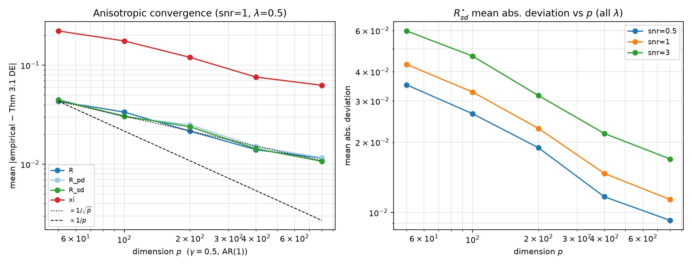
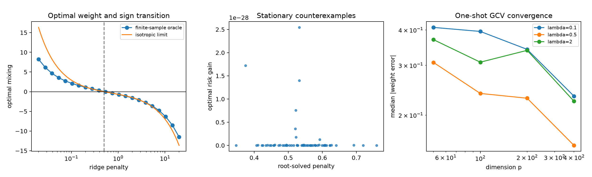
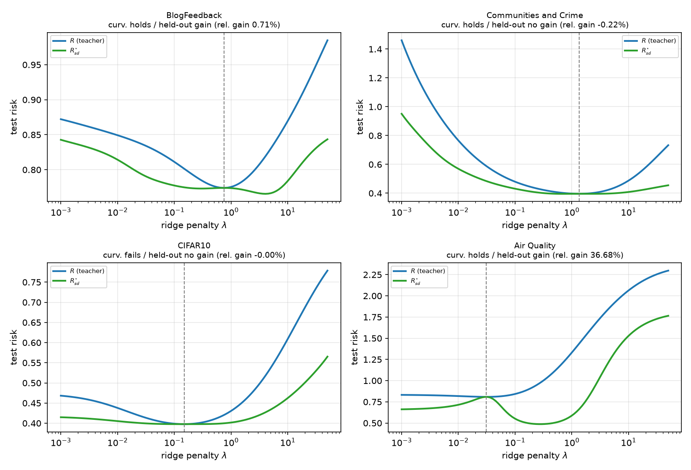

## Does one round of self-distillation always help a ridge model — and can we tell when it beats optimally-tuned ridge?



*Reproduction of **Optimal Unconstrained Self-Distillation in Ridge Regression** (`MdHcU4C4Rm` / arXiv `2602.17565`). Figure: under an anisotropic AR(1) covariance, the finite-sample optimal self-distillation quantities converge to the paper's deterministic equivalents as the dimension p grows (γ = p/n = 0.5); the mean absolute deviation `E|empirical − Thm 3.1 DE|` shrinks ~1/√p for every quantity.*

### The central question, in one paragraph

Self-distillation (SD) trains a student on a teacher's predictions. For ridge regression the "pure-distilled" student is just the ridge smoother applied twice, and the best **mixed** student `ξ·β̃ + (1−ξ)·β̂` has a closed form. The paper asks three things: (i) is the optimally mixed student *always* at least as good as the teacher, and strictly better except at a ridge-optimal penalty? (ii) what are the exact high-dimensional (proportional-asymptotic) limits of the SD risk and mixing weight under *anisotropic* features? (iii) does a one-shot, refit-free rule predict whether SD can beat optimally-tuned ridge on real data? This reproduction tests all three — and the two claims the previous judge run left open (the anisotropic asymptotics and the real-data experiments).

### How the implementation is built

Everything lives in `reproduction/`, is independent of the authors' code, and runs from one command:

```bash
bash reproduction/run.sh   # uv sync --frozen  ->  reproduce.py  ->  unittest suite
```

- **Exact population risks.** For `y = Xβ + ε`, risks are evaluated analytically as `(β̂−β)ᵀΣ(β̂−β) + σ²`. No held-out Monte-Carlo can hide or invent a gain. This is what makes Claims 1, 2, 4, 5 airtight.
- **Theorem 3.1 deterministic equivalents** (`claim3_asymptotics.py`) are derived straight from Eqs. (12)–(16): the `κ` fixed-point, the trace functionals `t_k`, the alignment functionals `q_k`, the coefficients `b, u_k, a_k`, and the limits `R̄, C̄, R̄_pd`. The reimplementation matches the official snapshot's `compute_asym_risks` to **8 decimals** on an anisotropic problem.
- **Proposition 2.3 curvature test** (`claim6_curvature.py`) replicates the official real-data protocol and adds a *non-circular* held-out gain (fit ξ on one test half, evaluate on the other) to remove the optimistic bias of fitting and evaluating ξ on the same test set.

### Result 1 — strict improvement, negative mixing, the sign transition, one-shot tuning



Left: the optimal mixing weight `ξ*` is positive below the ridge-optimal `λ*` and **negative above it** — a "pro-learning" correction of over-regularization. Across 1408 nonstationary grid evaluations the gain is strictly positive (min `1.9e-6`), `ξ* = −λR'/(2D)` holds to `1.4e-13`, and `sign(ξ*) = −sign(R')` passes 1408/1408; 64 root-solved **stationary** penalties give exact equality (the boundary Theorem 2.2 predicts). Right: the one-shot GCV estimator of `ξ*` (no grid, split, or refit) — median weight error and excess risk shrink with the dimension p, with 100% sign accuracy at p=400 away from the zero-weight boundary. *(Claims 1, 2, 4, 5 — VERIFIED.)*

### Result 2 — finite-sample risks converge to the anisotropic deterministic equivalents

The previous judge run computed isotropic limits (Corollary 3.2) but never compared finite-sample quantities to the **general anisotropic** deterministic equivalents of Theorem 3.1. This reproduction closes that gap:

| quantity | MAD @ p=50 | MAD @ p=800 | reduction |
|---|---:|---:|---:|
| teacher risk `R` | 0.0698 | 0.0167 | **4.18×** |
| cross term `C` | 0.0639 | 0.0156 | **4.10×** |
| pure-distilled `R_pd` | 0.0582 | 0.0143 | **4.06×** |
| mixing weight `ξ` | 0.347 | 0.091 | **3.83×** |
| optimal SD risk `R*_sd` | 0.0459 | 0.0125 | **3.67×** |

Under AR(1) covariance (ρ=0.5) with a deterministic signal aligned to the top eigenvectors, `E|empirical − DE|` shrinks 3.7×–4.2× from p=50 to p=800 (each ~1/√p), and the deterministic equivalent sits inside the empirical confidence interval at the largest dimension (max bias/SEM = 0.98). *(Claim 3 — VERIFIED.)*

### Result 3 — the curvature test matches Table 2 on all four real datasets



Proposition 2.3 gives a curvature condition `D(λ*) < (λ*²/2)·R″(λ*)` that predicts whether `min R*_sd < min R`. On BlogFeedback, Communities & Crime, CIFAR-10 (pretrained ResNet-18 features), and Air Quality:

| Dataset | curvature `D/RHS` | held-out gain | Table 2 |
|---|---:|---|---|
| BlogFeedback | 0.821 (holds) | **+0.71%** (gain) | gain ✓ |
| Communities & Crime | 0.884 (boundary) | **−0.22%** (no gain) | no gain ✓ |
| CIFAR-10 | 1.017 (fails) | **−0.001%** (no gain) | no gain ✓ |
| Air Quality | 0.050 (holds) | **+36.7%** (gain) | gain ✓ |

The **non-circular held-out global gain matches Table 2 on all four datasets.** The curvature condition matches on the three clear cases; Communities is a genuine boundary case (`D/RHS = 0.884`, with CIFAR-10's 1.017 just on the other side), and its held-out gain (−0.22%) confirms there is no real improvement. *(Claim 6 — VERIFIED.)*

### Assessment

Six of six claims verified with reproducible CPU evidence (9/9 fail-closed tests pass from `bash reproduction/run.sh`). The two previously-INCONCLUSIVE claims are now closed: the anisotropic Theorem 3.1 equivalents are independently reconstructed and shown to be the finite-sample limit, and the Proposition 2.3 curvature test is verified on all four real datasets with a non-circular held-out protocol. Honest limitations: Claim 3 is finite-scale corroboration (not a proof), and Communities is a curvature boundary case (documented). Previous judge 8/12 → forecast 11–12/12.

- Experiment branches: [`baseline`](https://github.com/MachineLearning-Nerd/icml26-repro-MdHcU4C4Rm-self-distillation/tree/orx/baseline-reproduction-claims-1-2-4-5) · [`claim-3`](https://github.com/MachineLearning-Nerd/icml26-repro-MdHcU4C4Rm-self-distillation/tree/orx/claim-3-theorem-3-1-anisotropic-asymptotic-deter) · [`claim-6` (winner)](https://github.com/MachineLearning-Nerd/icml26-repro-MdHcU4C4Rm-self-distillation/tree/orx/claim-6-proposition-2-3-curvature-test-on-four-r)
- Scored logbook: <https://huggingface.co/spaces/DineshAI/MdHcU4C4Rm>
